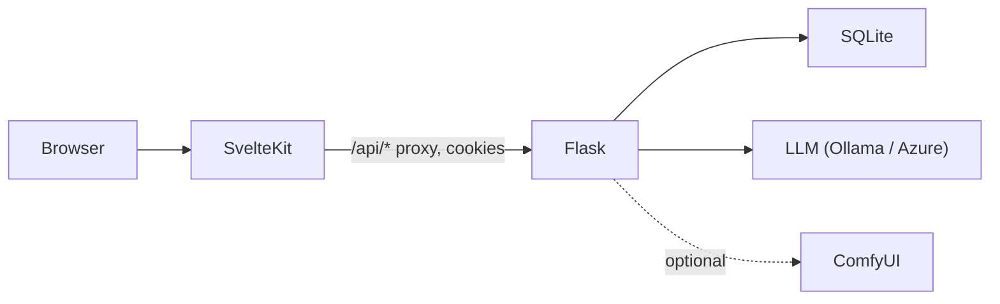

# Architecture

This document describes how **RPG Engine Basic** is structured: the LangGraph **subgraphs**, **runtime state**, the **Flask API**, and how the **SvelteKit** client talks to the backend.

## System overview

- **SvelteKit** (`web/`) is the user-facing app. Routes under `web/src/routes/api/[...path]/+server.ts` forward requests to Flask using `web/src/lib/server/flask.ts`, forwarding `Cookie` and relaying `Set-Cookie` so session auth works through the proxy.
- **Flask** (`app.py`) owns all business logic: users, stories, subgraphs, saves, play orchestration, and AI/image endpoints.
- **SQLite** (`rpg.db`, path in `db.py`) stores persistent data; compiled subgraphs are also held in an in-memory **registry** after load.

## Conversation engine: subgraphs (LangGraph)

A **subgraph** is a JSON document validated by `graphs/builder.py::validate_graph_definition` and compiled with **LangGraph**’s `StateGraph`.

### State shape

The shared `State` `TypedDict` in `graphs/builder.py` defines the fields graphs expect, including:

- **Player input / output:** `message`, `response`
- **Memory:** `history` (list of turn strings), `memory_summary` (LLM-compressed summary)
- **Story context:** `narrator` (`prompt`, `model`), `player`, `characters`, `game_title`, `opening`, `paused`, `turn_count`

At runtime, `app.py` adds private keys such as `_story_id` and `_subgraph_name` for bookkeeping; these are not part of the graph schema but ride along in the same dict.

### Nodes (`nodes/`)

Registered in `nodes/__init__.py` as `NODE_REGISTRY`:

| Node | LLM? | Role |
|------|------|------|
| `narrator` | Yes | Builds the main scene response from prompts + context |
| `npc` | Yes | Appends in-character dialogue per NPC |
| `mood` | Yes | Adjusts per-character mood axes from the player’s action |
| `condense` | Yes | Refreshes `memory_summary` from `history` |
| `memory` | No | Appends the turn to `history`, updates `turn_count` |

### Routers (`routers/`)

- `route_graph_entry` — always enters at `narrator`.
- `route_after_narrator` — if `characters` is non-empty, next is the NPC path (graphs map this to `mood` when mood is in the pipeline); otherwise skips to `condense`.

Example: `graphs/conversation_with_mood.json` wires `narrator` → conditional → `mood` → `npc` → `condense` → `memory` → end.

### Registry

`graphs/registry.py` loads every row from `subgraphs`, parses JSON, compiles, and caches. CRUD routes in `app.py` call `reload_one` / `remove` so the cache stays consistent. **Play** uses `registry.require(state["_subgraph_name"])` after checking `name in registry`.

## Play flow

1. **`POST /play/start`** — Builds state, applies main-graph phase 0 when `main_graph_template_id` is set (`play_phases`), optionally pre-fills `response` with `opening`, stores the session in **`GameSessionCache`** (LRU + TTL; `GAME_SESSION_CACHE_MAX=0` disables and forces DB reload each time), upserts slot 0, increments `play_count`.
2. **`POST /play/chat`** — Per-session lock, `registry.require(...).invoke(state)`, history merge, **`advance_phase_after_turn`**, persist slot 0. Rate-limited via `RATE_LIMIT_PLAY_CHAT`.
3. **`GET /play/status`**, **`POST /play/save|load`**, pause/unpause — same cache + `_ensure_play_session` / `hydrate_runtime_from_story_save` so template-based saves keep `_subgraph_name`.

Concurrency: `threading.Lock` per `session_{story_id}_{user_id}` avoids overlapping LLM turns for the same adventure.

**`/health`** — DB `SELECT 1`; if `LLM_PROVIDER=ollama`, probes `OLLAMA_HOST/api/tags`.

## Stories and seed data

- **DB table `stories`** holds flat columns plus JSON `characters` (personalities, mood axes, portraits, etc.).
- **`db.py::seed_builtin_stories`** imports `stories/*.json` once per title for the synthetic `system` user and marks them public.
- **`seed_builtin_subgraphs`** imports `graphs/*.json` as builtin subgraphs (same `system` user).

## Main graph templates (phases)

The **`main_graph_templates`** table and UI (`web/src/routes/graphs/main/+page.svelte`) let authors define ordered **phases**, each referencing a **subgraph name** and a **transition** (`milestone`, `rules`, `turns`, `location`, `manual`) with a string `condition`.

**Main graph in play:** If `stories.main_graph_template_id` is set, `play_phases.apply_main_graph_to_new_state` initializes `_phase_index`, `_turns_in_phase`, and `_subgraph_name` from the first phase. After each `/play/chat` turn, `advance_phase_after_turn` may advance the phase when the template’s `transition` matches (`turns`, `milestone`, `manual`, `location`, or `rules` via `_rules_transition`). If the column is null, play uses `stories.subgraph_name` only (same as before).

## AI and images

- **LLM** — `llm/__init__.py::get_llm` selects `OllamaProvider` or `AzureProvider` from `LLM_PROVIDER`.
- **Text assist** — `/ai/generate-story`, `/ai/improve-text`, `/ai/suggest`, `/ai/generate-book` build prompts and parse or return plain text.
- **ComfyUI** — `comfyui_client.py` queues a fixed workflow template; `is_available()` checks `COMFYUI_URL`. Cover/portrait/scene routes write PNGs under `web/static/images/{covers,portraits,scenes}/`.

## Security notes (operational)

- Use a strong `SECRET_KEY` in production; enable `SESSION_COOKIE_SECURE` when serving HTTPS.
- Subgraphs are Python-callable graphs: only trusted users should publish arbitrary graph JSON (same trust model as any code-adjacent config).

## Related files

| Concern | Location |
|---------|----------|
| API surface | `app.py` |
| Schema + seeds | `db.py` |
| Graph compile | `graphs/builder.py`, `graphs/registry.py` |
| Node behavior | `nodes/*.py` |
| Frontend proxy | `web/src/lib/server/flask.ts`, `web/src/routes/api/[...path]/+server.ts` |
