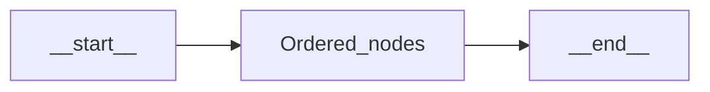
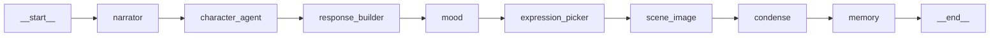
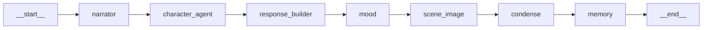
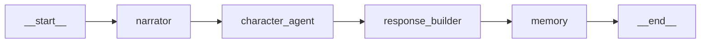
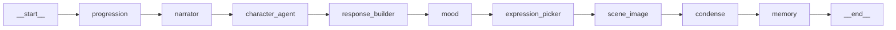
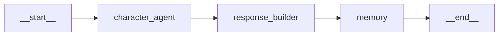

# Graph definitions (`graphs/`)

Builtin **subgraphs** are JSON pipelines under [`graphs/`](../graphs/) plus Python tooling. Each graph is a **linear** LangGraph: registered nodes run in edge order from `__start__` to `__end__`.

## Shared mechanics

- **Compilation**: [`graphs/builder.py`](../graphs/builder.py) builds a `StateGraph(State)` from JSON. The `nodes` array registers callables from [`nodes/__init__.py`](../nodes/__init__.py) (`NODE_REGISTRY`); `edges` map `__start__` / `__end__` to LangGraph `START` / `END`.
- **Runtime**: [`graphs/registry.py`](../graphs/registry.py) loads definitions (typically from the database), compiles them, and caches by `name`.
- **One turn**: The player `message` flows through the chain. Terminal state includes `response`, `_bubbles`, updated `characters` (moods, portraits), `history`, `memory_summary` when `condense` runs, `_scene_image`, `_shown_images`, and progression-related fields when that node is present.

## Node roles (story / state impact)

| Node | Role |
|------|------|
| `progression` | Runs before narration: stage gates (turns, mood thresholds, optional LLM check on player action). Writes `_progression`, `_progression_state`, `_narrator_progression` for stage-aware NPC and narrator behavior ([`nodes/progression.py`](../nodes/progression.py)). |
| `narrator` | LLM scene / world narration only (no character quoted lines) → `_narrator_text` ([`nodes/narrator.py`](../nodes/narrator.py)). |
| `character_agent` | Per-NPC LLM dialogue + short physical action using narrator text, history, optional mood / progression context → `_character_responses` ([`nodes/character_agent.py`](../nodes/character_agent.py)). |
| `response_builder` | No LLM: merges narrator + characters into `response` and `_bubbles` for the UI ([`nodes/response_builder.py`](../nodes/response_builder.py)). |
| `mood` | Per-axis LLM classification; updates `characters[*].moods` ([`nodes/mood.py`](../nodes/mood.py)). |
| `expression_picker` | LLM picks a portrait variant from `characters[*].portraits` → `_active_portraits` ([`nodes/expression_picker.py`](../nodes/expression_picker.py)). |
| `scene_image` | Tag / trigger match against `story.scene_images` → `_scene_image`, `_shown_images` ([`nodes/scene_image.py`](../nodes/scene_image.py)). |
| `condense` | LLM rolling summary → `memory_summary` (about 60–80 words) ([`nodes/condense.py`](../nodes/condense.py)). |
| `memory` | Appends a structured turn to `history`, bumps `turn_count`; snapshots mood, scene image, portraits ([`nodes/memory.py`](../nodes/memory.py)). |

---

## 1. `narrator_chat` — [`graphs/narrator_chat.json`](../graphs/narrator_chat.json)

**Architecture**: Full linear stack: world voice → NPCs → assembly → affect → faces → sidebar art → compressed memory → persistence.

**Story contribution**: Third-person scene framing, emotionally tracked NPCs, expression-matched portraits when variants exist, optional scene gallery images, and a short rolling summary for long-horizon context. **Cost / latency**: Highest (many LLM steps per turn).

---

## 2. `narrator_chat_classic` — [`graphs/narrator_chat_classic.json`](../graphs/narrator_chat_classic.json)

**Architecture**: Same as `narrator_chat` but **without** `expression_picker`; mood connects directly to `scene_image`.

**Story contribution**: Full narrator, mood, scene matching, and memory, with **default / static** portraits from each character’s `portrait` field only (no LLM expression selection). **Tradeoff**: Fewer LLM calls than `narrator_chat`; less reactive portrait art.

---

## 3. `narrator_chat_lite` — [`graphs/narrator_chat_lite.json`](../graphs/narrator_chat_lite.json)

**Architecture**: Narrator → characters → assembly → memory only.

**Story contribution**: Same narrative + dialogue shape as the full graph, but **no** per-turn mood updates, **no** expression picking, **no** scene gallery matching, and **no** `condense`, so `memory_summary` is not refreshed each turn. Full `history` is still appended in `memory`. **Tradeoff**: Fastest narrated path for prototyping or latency-sensitive play.

---

## 4. `narrator_chat_progression` — [`graphs/narrator_chat_progression.json`](../graphs/narrator_chat_progression.json)

**Architecture**: `progression` **prepends** the same stack as `narrator_chat` (order after `progression` matches `narrator_chat`).

**Story contribution**: Everything `narrator_chat` adds, plus **stage-gated** arcs from each character’s `progression` config and `_progression_state` (turns in stage, mood thresholds, optional criteria). Injects stage directives for NPCs and pacing hints for the narrator. **Tradeoff**: Extra logic and possible extra LLM calls inside `progression` when evaluating player actions.

---

## 5. `chat_direct` — [`graphs/chat_direct.json`](../graphs/chat_direct.json)

**Architecture**: No narrator; `_narrator_text` stays empty for the turn unless set elsewhere.

**Story contribution**: **Pure multi-character chat** — no third-person scene layer and no mood, expression, scene, or condense nodes in the graph. The UI still receives `response` / `_bubbles` (character-focused). **Use case**: Dialogue-first stories where a separate narrator voice is not wanted.

---

## Supporting modules (not graph JSON)

- [`graphs/builder.py`](../graphs/builder.py) — `State` schema, `build_graph_from_json`, `validate_graph_definition`.
- [`graphs/registry.py`](../graphs/registry.py) — compile cache (often DB-backed).
- [`graphs/__init__.py`](../graphs/__init__.py) — re-exports builder and `SubgraphRegistry`.

---

## Quick comparison

| Capability | `narrator_chat` | `narrator_chat_classic` | `narrator_chat_lite` | `narrator_chat_progression` | `chat_direct` |
|------------|-----------------|-------------------------|----------------------|----------------------------|----------------|
| Narration | yes | yes | yes | yes | no |
| Mood tracking | yes | yes | no | yes | no |
| Portrait variants (LLM) | yes | no | no | yes | no |
| Scene gallery | yes | yes | no | yes | no |
| Rolling `memory_summary` (`condense`) | yes | yes | no | yes | no |
| Progression arcs | no | no | no | yes | no |

See also [SUBGRAPHS.md](SUBGRAPHS.md) for a short picker table and migration notes.
